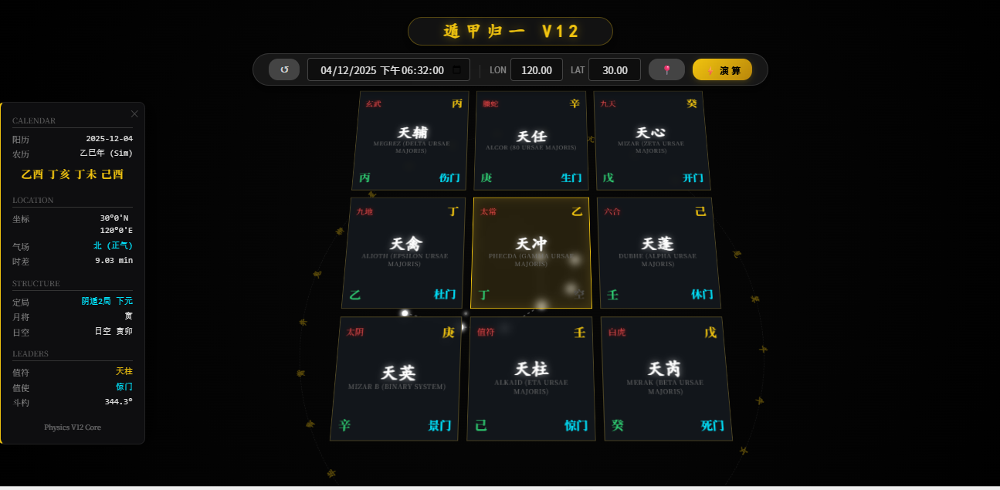

# 遁甲归一 (Dunjia Unity) V12 - Physics Core


> **"以天体物理重构奇门模型，用全息视界呈现时空能量。"**

**遁甲归一 (Dunjia Physics)** 是一个基于天体物理学与真太阳时的奇门遁甲排盘引擎。与传统查表法不同，本项目引入了天文学参数（如北斗斗柄指向、真太阳时差、二十八星宿视位置）来驱动奇门定局与排盘，实现了"物理全息投影"式的可视化交互。


*(建议上传一张运行截图命名为 preview.png 放在仓库根目录，即可在此处显示)*

## ✨ 核心特性 (Core Features)

### 1. V12 物理内核 (Physics Engine)
* **真太阳时 (True Solar Time)**: 摒弃传统死板的北京时间切局，内置 **EoT (Equation of Time)** 时差补偿算法，精确到秒。
* **天文定局**: 实现 **"斗杓定月建"** 算法，根据北斗七星斗柄指向动态计算月将与排盘。
* **南半球适配**: 内置气场镜像逻辑，自动识别纬度并调整阴阳遁。

### 2. 3D 全息视界 (Holographic Visualization)
* **纯 CSS3D 渲染**: 无需庞大的 WebGL 引擎（如 Three.js），仅用原生 HTML5/CSS3 实现高性能 3D 宇宙视界。
* **沉浸式背景**: 
    * **二十八星宿环**: 黄金比例 (850px) 环绕，缓慢自转。
    * **北斗九星**: 动态连线，随物理参数实时旋转指向。
* **立式排盘**: 20° 仰角悬浮排盘，文字清晰，如电子沙盘般直观。

### 3. 现代化 UI (Modern HUD)
* **双层悬浮顶栏**: 分离式标题与控制条，极简工业风。
* **侧边栏清单**: 详细数据（干支、节气、空亡等）收纳于左侧，支持一键折叠/展开。
* **自动定位**: 集成浏览器 Geolocation API，自动获取并填入经纬度。

## 🛠️ 安装与运行 (Installation)

本项目采用 **Python 后端 + HTML 前端** 的轻量级架构，无复杂的依赖包。

### 第一步：克隆项目
```bash
git clone [https://github.com/weig19364/Dunjia_Physics.git](https://github.com/weig19364/Dunjia_Physics.git)
cd Dunjia_Physics

